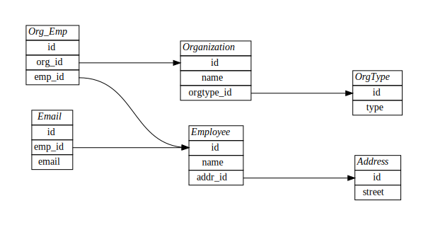

# &lt;/salt&gt;

## PostgreSQL Lab

### Setup the environment
- `docker-compose up`
- Open `pgadmin` in your [browser](http://localhost:5050)
- Create a new server called __salt-db__.
- Add the connection details `host=postgres`, `maintenancedb=saltdb`, `username=salt` and `password=secret`.
- Open the public schema under the database `saltdb`.
- Open the _Query Tool_ from the tools menu.

### Create a new schema and insert data
#### Create a table
Paste the following snippet into the query tool, mark the text and hit `F5`.
```sql
create table if not exists OrgType (
	id serial primary key,
	type varchar not null
);
```

Inspect the tables under the public schema and verify that you can find the new table.

#### Insert some data
Paste the following snippet into the query tool, mark the text and hit `F5`.
```sql
insert into OrgType(type) values ('Company');
insert into OrgType(type) values ('School');
insert into OrgType(type) values ('Government');
```

Now verify you have inserted data by running
```sql
select * from OrgType;
```

#### Create a relation
```sql
create table if not exists Organization(
	id serial primary key,
	name varchar not null,
	orgtype_id integer,
	foreign key (orgtype_id) references OrgType(id)
);
```
```sql
insert into Organization(name, orgtype_id) 
values('DVD Rental', (select id from OrgType where type = 'Company'));
```

Now, insert some more Organizations of different types.

#### Query data
Query the organizations and filter on OrgType using `inner joins`, like so
```sql
select * from Organization as o
inner join OrgType as ot on o.orgtype_id = ot.id
where ot.type = 'Company';
```
Try a few different OrgTypes. _Can you come up with any additional filters?_

#### Create a larger schema
Try to create this schema from what you already have by adding more tables:


Try to come up with some data (why not use faker?) and fill all your tables with _at least_ two rows each.

Play around with the data model you have and try to come up with some interesting queries.

### Additional exercise
#### JSON
Drop the tables `Employee`, `Address` and `Email`. Create a new `Employee` table with only an `id` and `jsonb` field called `data`. Come up with a good model to represent all the deleted tables and insert new records in the new table. Can you query specific fields from the json documents?
